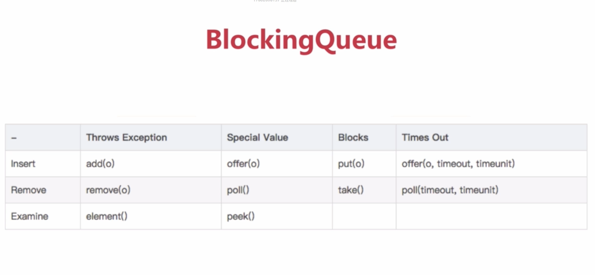

#### BlockingQueue的API

#### BlockingQueue的实现类

- ArrayBlockingQueue：有界，初始化时指定大小，内部是一个数组
- DelayQueue: 无界，内部元素必须实现Delayed接口，Delayed接口继承了Comparable接口，内部是PriorityBlockingQueue和lock，其中的对象只能在其到期时才能从队列中取走
- LinkedBlockingQueue: 大小配置可选，初始化指定大小则是有边界，没有指定则无大小，内部是链表
- PriorityBlockingQueue: 带优先级，没变边界，有排序规则，可以插入null,元素必须实现Comparable接口
- SynchronousQueue: 内部仅允许容纳一个元素，当一个线程插入一个元素就会被阻塞，除非这个元素被其他线程消费