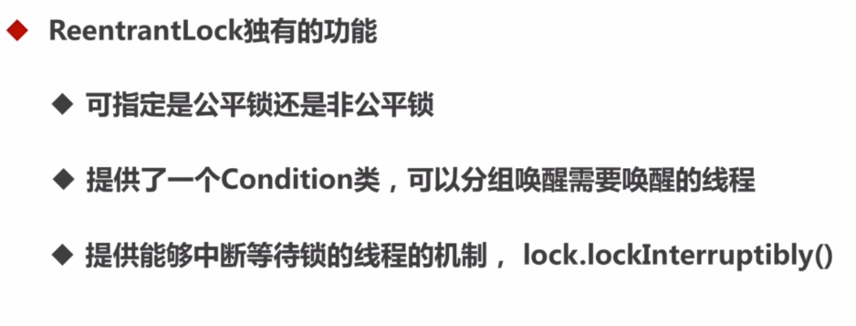

#### ReentrantLock与synchronized的区别

- 可重入性： 两者都是可重入锁，两者区别不大
- 锁的实现：synchronized依赖于JVM实现，ReentrantLock依赖于JDK实现，相当于操作系统实现和用户自己敲代码实现的区别
- 性能的区别：synchronized优化以前很差，但是synchronized引入轻量级锁、自旋锁、偏向锁之后，两者性能差不多
- 功能区别：1. synchronized方便简洁，不需要手工释放锁，ReentrantLock需要手工释放锁
    2. ReentrantLock更加灵活，也有自己独有的功能，比如：

